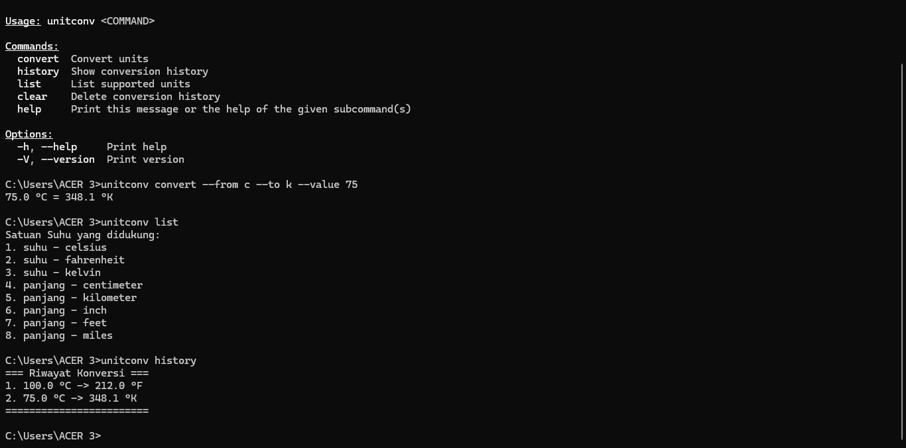

# 🔄 UnitConv - CLI Unit Converter

A smart command-line tool to convert Temperature and Length units, built with Rust.


[](https://opensource.org/licenses/MIT)

## Preview



## ✨ Features
* **Smart Conversion**: Automatically detects if input is Temperature or Length.
* **Temperature**: Celsius, Fahrenheit, Kelvin (with `°` symbol support).
* **Length**: Meter, Kilometer, Centimeter, Millimeter, Miles, Inch, Feet.
* **History**: Saves your conversion history automatically.
* **Management**: Commands to view list of units and clear history.

## 🚀 Usage

### 1. Convert Units
```bash
# Temperature
cargo run -- convert --from c --to f --value 100

# Length
cargo run -- convert --from km --to miles --value 50
```
If you are using Windows Command Prompt:
```bash
# Temperature
unitconv convert --from c --to f --value 100

# Length
unitconv convert --from km --to miles --value 50
```

### 2. Check Supported Units
```bash
cargo run -- list
```
If you are using Windows Command Prompt:
```bash
unitconv list
```

### 3. View History
```bash
cargo run -- history
```
If you are using Windows Command Prompt:
```bash
unitconv history
```

### 4. Clear History
```bash
cargo run -- clear
```
If you are using Windows Command Prompt:
```bash
unitconv clear
```

## 🛠️ Installation

1. Clone this repository.
2. Run with Cargo:
```bash
cargo run -- --help
```
